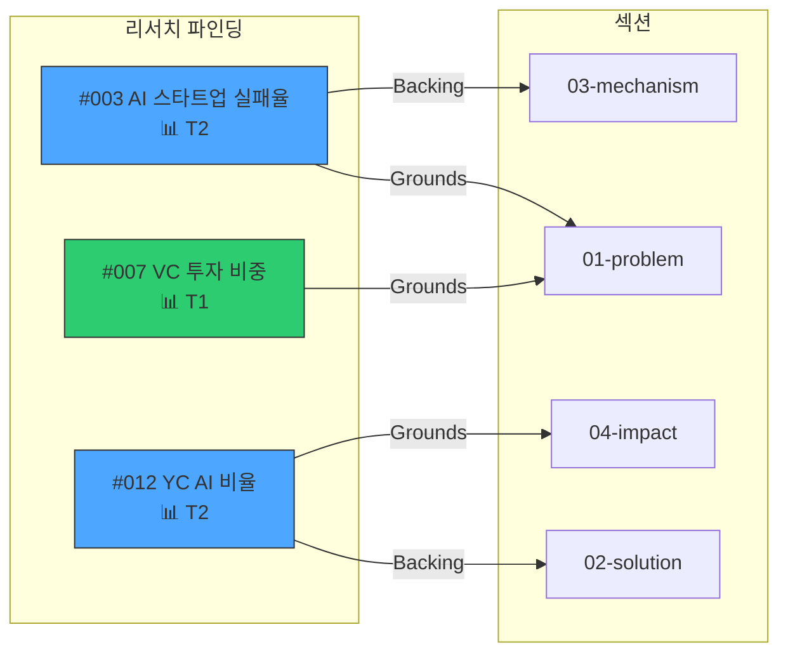

# Citation Graph — 인용 그래프 명세

리서치 파인딩과 섹션 필드 간의 인용 관계를 양방향으로 추적한다.
모든 인용 검증, 만료 전파, 출처 기반 초안 생성이 이 문서를 참조한다.

---

## 인용 형식

### 파인딩 파일 (`research/*.md`)

파인딩 frontmatter의 `citations` 필드에 해당 파인딩을 인용한 섹션-필드를 기록한다:

```yaml
---
id: 003
citations:
  - "01-problem.Grounds[2]"
  - "03-mechanism.Backing[0]"
---
```

형식: `{section_id}.{field}[{index}]`
- `section_id`: 섹션 파일명에서 확장자를 제거한 식별자 (예: `01-problem`)
- `field`: Toulmin 필드명 (`Grounds`, `Backing`, `Warrant`, `Qualifier`, `Rebuttal`)
- `index`: 해당 필드 내 항목 인덱스 (0-based)

### 섹션 파일 (`sections/*.md`)

섹션 본문 내에서 인라인 인용으로 파인딩을 참조한다:

```markdown
Grounds:
  - "국내 AI 스타트업의 72%가 Series A 이전에 실패한다 (📊 T2, research #003)"
  - "2024년 VC 투자 총액 중 AI 분야가 38% 차지 (📊 T1, research #007)"

Backing:
  - "Y Combinator 2023 배치에서 AI 비율 40% 돌파 (📊 T2, research #012)"
```

인라인 형식: `(📊 T{tier}, research #{NNN})`
- `📊`: 리서치 인용 표시자
- `T{tier}`: 출처 신뢰도 등급 (`references/source-credibility.md` 참조)
- `#{NNN}`: 파인딩 ID (3자리 순번)

외부 출처 직접 인용 (파인딩 파일 없이):
```markdown
  - "OECD 2024 보고서에 따르면... (https://oecd.org/...)"
```

---

## 그래프 구조

### 순방향 맵 (Forward Map)

파인딩 → 인용된 섹션 필드 목록:

```
finding_003 → [01-problem.Grounds[2], 03-mechanism.Backing[0]]
finding_007 → [01-problem.Grounds[3]]
finding_012 → [02-solution.Backing[1], 04-impact.Grounds[0]]
```

**소스**: 각 파인딩 파일의 `citations` 필드에서 구축.

### 역방향 맵 (Reverse Map)

섹션 필드 → 해당 필드를 뒷받침하는 파인딩 ID 목록:

```
01-problem.Grounds[2] → [finding_003]
01-problem.Grounds[3] → [finding_007]
03-mechanism.Backing[0] → [finding_003]
02-solution.Backing[1] → [finding_012]
04-impact.Grounds[0] → [finding_012]
```

**소스**: 순방향 맵을 반전하여 구축. 섹션 파일의 인라인 인용으로 교차검증.

---

## 그래프 구축 알고리즘

```
FUNCTION build_citation_graph():

  forward_map = {}
  reverse_map = {}
  orphaned = []

  # 1단계: 파인딩 파일의 citations 필드 파싱
  FOR EACH file IN research/*.md:
    finding_id = file.frontmatter.id
    citations = file.frontmatter.citations  # 예: ["01-problem.Grounds[2]"]

    IF citations IS NOT empty:
      forward_map[finding_id] = citations

      FOR EACH citation IN citations:
        reverse_map[citation].append(finding_id)

  # 2단계: 섹션 파일의 인라인 인용 파싱
  FOR EACH file IN sections/*.md:
    section_id = filename_without_extension(file)

    FOR EACH match OF pattern `📊 T\d, research #(\d{3})` IN file.content:
      finding_id = match.group(1)
      field = determine_field_from_context(match)  # Grounds/Backing 등
      ref = "{section_id}.{field}"

      # 순방향 맵과 교차검증
      IF ref NOT IN forward_map[finding_id]:
        orphaned.append({
          type: "inline_only",
          finding: finding_id,
          location: ref,
          message: "섹션에서 인용하지만 파인딩 citations에 미등록"
        })

  # 3단계: 파인딩 파일 존재 검증
  FOR EACH finding_id IN all_referenced_ids:
    IF NOT exists(research/{finding_id}-*.md):
      orphaned.append({
        type: "missing_file",
        finding: finding_id,
        message: "인용된 파인딩 파일이 존재하지 않음"
      })

  # 4단계: 섹션 필드 존재 검증
  FOR EACH citation IN all_citations:
    section_file = parse_section(citation)  # "01-problem"
    IF NOT exists(sections/{section_file}.md):
      orphaned.append({
        type: "missing_section",
        citation: citation,
        message: "인용 대상 섹션 파일이 존재하지 않음"
      })

  RETURN { forward_map, reverse_map, orphaned }
```

---

## 인용 기반 전파 (Cascading)

### 파인딩 상태 변경 시

파인딩이 `stale` 또는 `rejected`로 변경되면 인용 그래프를 통해 영향 범위를 추적한다:

```
FUNCTION cascade_finding_status(finding_id, new_status):

  IF new_status NOT IN ["stale", "rejected"]:
    RETURN  # accepted/applied 변경은 전파 불필요

  affected = reverse_map[finding_id]  # 이 파인딩을 인용한 모든 섹션 필드

  FOR EACH section_field IN affected:
    section = parse_section(section_field)
    field = parse_field(section_field)

    IF field == "Grounds":
      # Grounds가 약해지면 논증 전체에 영향
      flag_for_review(section, {
        severity: "major",
        message: "Grounds[{index}]의 출처 (research #{finding_id})가 {new_status} 상태입니다. 검토 필요.",
        suggestion: "대체 출처를 확보하거나 해당 Grounds를 수정하세요."
      })

    IF field == "Backing":
      # Backing은 보조 자료이므로 severity 낮음
      flag_for_review(section, {
        severity: "minor",
        message: "Backing[{index}]의 출처 (research #{finding_id})가 {new_status} 상태입니다.",
        suggestion: "보조 자료 업데이트를 권장합니다."
      })

  # 자동 무효화하지 않음 — 인간이 최종 판단
  RETURN affected
```

> **핵심 원칙**: 전파는 "제안"이지 "자동 무효화"가 아니다. 출처가 만료되었더라도 해당 Grounds의 주장 자체가 다른 출처로 뒷받침될 수 있다.

### 섹션 수정 시

섹션이 revise되어 인라인 인용이 변경되면:

```
FUNCTION on_section_revised(section_id):

  old_refs = get_previous_inline_refs(section_id)
  new_refs = get_current_inline_refs(section_id)

  removed = old_refs - new_refs
  added = new_refs - old_refs

  FOR EACH finding_id IN removed:
    # 이 파인딩이 다른 섹션에서도 인용되는지 확인
    other_refs = forward_map[finding_id] - removed_citations

    IF other_refs IS empty:
      mark_finding_orphaned(finding_id, {
        message: "어떤 섹션에서도 인용되지 않음. 불필요한 파인딩일 수 있습니다."
      })

  FOR EACH finding_id IN added:
    # 파인딩 citations 필드에 새 인용 추가
    update_finding_citations(finding_id, section_id, field)

  RETURN { removed, added }
```

---

## 인용 검증 규칙

### 필수 검증

| 규칙 | 대상 | 위반 시 |
|------|------|---------|
| 모든 Grounds는 최소 1개 인용 필요 | `sections/*.md` Grounds 항목 | 🔴 "출처 미명시" challenge 플래그 |
| 인용된 파인딩 파일이 존재해야 함 | `research #NNN` 참조 | ⚠️ orphaned citation 경고 |
| 파인딩 citations와 인라인 인용 일치 | 양방향 교차검증 | 💡 동기화 불일치 경고 |

### 출처 미명시 감지

```
FUNCTION check_uncited_grounds():

  uncited = []

  FOR EACH section IN sections/*.md:
    FOR EACH ground IN section.Grounds:
      has_research_ref = contains(ground, "research #")
      has_url = contains(ground, "http")
      has_emoji_ref = contains(ground, "📊")

      IF NOT (has_research_ref OR has_url OR has_emoji_ref):
        uncited.append({
          section: section_id,
          ground_index: index,
          content: ground,
          severity: "critical"
        })

  RETURN uncited
```

### 다중 인용 추적

동일 파인딩이 여러 섹션에서 인용될 수 있다. 이는 정상이며, 맵에서 시각적으로 확인 가능하다:

```
finding_003:
  └─ 01-problem.Grounds[2]
  └─ 03-mechanism.Backing[0]
  └─ 05-conclusion.Grounds[1]

→ 3개 섹션에서 인용됨 (핵심 파인딩)
```

---

## 시각화 (`/sowhat:map --citations`)

### Mermaid 다이어그램 생성



### 색상 규칙

| Tier | 색상 | Hex |
|------|------|-----|
| T1 | 초록 (green) | `#2ecc71` |
| T2 | 파랑 (blue) | `#4da6ff` |
| T3 | 노랑 (yellow) | `#f1c40f` |
| T4 | 빨강 (red) | `#e74c3c` |

### 추가 시각화 옵션

- `--citations orphaned`: 고아 인용만 표시 (빨간 점선)
- `--citations uncited`: 출처 미명시 Grounds 강조
- `--citations tier T1`: 특정 Tier 파인딩만 필터

---

## 초안 연동 (Draft Integration)

### `/sowhat:draft` 자동 참고문헌 생성

`/sowhat:draft` 실행 시 인용 그래프에서 참조된 모든 파인딩을 수집하여 참고문헌 섹션을 자동 생성한다.

### 형식 옵션

#### APA 형식 (기본)

```markdown
## 참고문헌

### Tier 1 — 1차 출처
[1] OECD. (2024). AI Policy Observatory Report. https://oecd.org/...
[2] Kim, J. et al. (2023). Startup Failure Analysis. Journal of Entrepreneurship, 45(2), 112-130.

### Tier 2 — 전문 출처
[3] McKinsey & Company. (2024). State of AI Report. https://mckinsey.com/...
[4] Bloomberg. (2024). "VC Investment Trends in AI." https://bloomberg.com/...

### Tier 3 — 준전문 출처
[5] Park, S. (2024). "AI 스타트업 생존 전략." Medium. https://medium.com/...
```

#### 각주 형식 (footnotes)

```markdown
본문 내:
  국내 AI 스타트업의 72%가 Series A 이전에 실패한다.[^1]

하단:
  [^1]: McKinsey & Company. (2024). State of AI Report. p.42.
```

#### 인라인 형식 (inline)

```markdown
  국내 AI 스타트업의 72%가 Series A 이전에 실패한다 (McKinsey, 2024).
```

### Tier별 그룹핑

참고문헌은 Tier별로 그룹핑하여 출처의 신뢰도 수준을 독자가 한눈에 파악할 수 있게 한다.
T4 출처는 "비검증 출처" 라벨과 함께 별도 표기한다.

---

## config.json 연동

```json
"citations": {
  "orphaned": 0,
  "total": 12,
  "unlinked_grounds": 2
}
```

| 필드 | 설명 | 업데이트 시점 |
|------|------|--------------|
| `total` | 전체 인용 수 (파인딩 ↔ 섹션 연결 수) | 그래프 구축 시 |
| `orphaned` | 고아 인용 수 (파일 누락 또는 동기화 불일치) | 그래프 구축 시 |
| `unlinked_grounds` | 출처 미명시 Grounds 수 | 검증 실행 시 |

### 카운트 업데이트 시점

| 액션 | total | orphaned | unlinked_grounds |
|------|-------|----------|------------------|
| 파인딩 accept + 섹션 반영 | +1 | — | -1 (해당 시) |
| 파인딩 reject | — | 인용 존재 시 +N | — |
| 섹션 revise (인용 추가) | +1 | — | -1 |
| 섹션 revise (인용 제거) | -1 | 파인딩 고아화 시 +1 | — |
| 그래프 재구축 | 재계산 | 재계산 | 재계산 |

---

## 핵심 원칙

- **양방향 추적이 기본** — 순방향(파인딩→섹션)과 역방향(섹션→파인딩) 모두 유지해야 완전한 감사 추적이 가능하다
- **전파는 제안이지 자동 무효화가 아니다** — 출처가 만료되어도 인간이 최종 판단한다
- **출처 없는 Grounds는 challenge 대상** — 모든 Grounds는 최소 1개의 인용(파인딩 또는 외부 URL)을 가져야 한다
- **고아 인용은 즉시 해소** — 파인딩 파일 누락, 동기화 불일치는 발견 즉시 경고한다
- **Tier 정보를 인용에 포함** — 인라인 인용에 Tier를 명시하여 독자가 출처 신뢰도를 즉시 판단할 수 있게 한다
