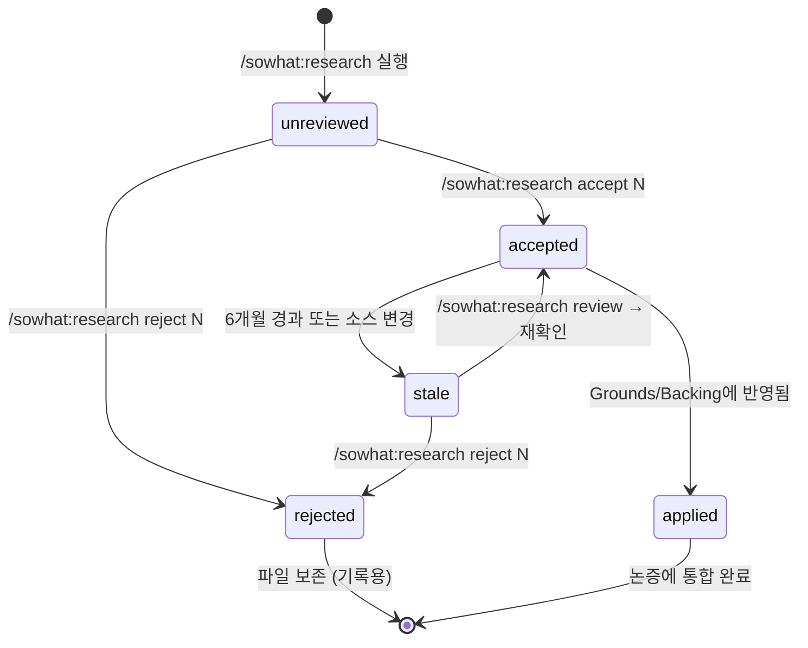

# Research Finding Lifecycle

연구 파인딩 파일(`research/NNN-{slug}.md`)의 전체 생명주기를 정의한다.

---

## 상태 흐름



## 상태 정의

| Status | 의미 | 파인딩 파일 frontmatter |
|--------|------|----------------------|
| `unreviewed` | 생성됨, 인간 미검토 | `status: unreviewed` |
| `accepted` | 인간이 유효하다고 판단 | `status: accepted` |
| `rejected` | 인간이 무관하거나 신뢰 불가로 판단 | `status: rejected` |
| `applied` | 해당 섹션의 Grounds/Backing에 반영 완료 | `status: applied` |
| `stale` | 시간 경과 또는 소스 변경으로 재검토 필요 | `status: stale` |

---

## 생성 (Creation)

### 트리거
- `/sowhat:research URL` — URL 분석
- `/sowhat:research {topic}` — 토픽 검색
- `/sowhat:research` (인자 없음) — 자율 리서치
- `/sowhat:inject {section} {url|file}` — 수동 증거 주입
- debate 중 Research-Agent 자동 트리거

### 파일 생성 규칙

```
research/{NNN}-{slug}.md

NNN: 3자리 순번 (001, 002, ...)
slug: 검색어/URL에서 추출한 kebab-case 식별자
```

### Frontmatter

```yaml
---
id: NNN
type: url | topic | auto | debate | manual
source: "{URL 또는 검색어}"
tier: T1 | T2 | T3 | T4
tier_reasons:
  - "{판정 이유}"
created: "{ISO8601}"
relevant_sections: ["{section_id}", ...]
status: unreviewed
applied_to: null
stale_reason: null
citations: []
---
```

> **tier 필드**: `references/source-credibility.md`의 판정 알고리즘에 따라 자동 설정.
> **citations 필드**: 이 파인딩을 인용한 섹션-필드 목록 (예: `["01-problem.Grounds[2]"]`). `references/citation-graph.md` 참조.

---

## 리뷰 (Review)

### `/sowhat:research review`

미검토 파인딩 목록을 보여준다:

```
📋 미검토 파인딩: {N}건

  [001] {slug} — {source 한 줄} ({created} 생성)
        관련 섹션: {sections}
  [002] ...

  accept {N}: 수용 → 섹션에 반영 제안
  reject {N}: 기각 → 기록만 보존
  all: 전체 보기
```

---

## 수용 (Accept)

### `/sowhat:research accept N`

1. 파인딩 파일의 `status: accepted`로 변경
2. 관련 섹션의 Open Questions에 반영 제안 추가
3. config.json `research.unreviewed` 감소
4. argument-log.md에 기록

### 반영 (Application)

accepted 파인딩이 실제로 섹션에 반영되면:
- expand/revise 중 Grounds 또는 Backing에 데이터 추가
- 파인딩 파일의 `status: applied`, `applied_to: "{section_id}"`로 변경
- 원본 파인딩 파일은 보존 (출처 추적용)

---

## 기각 (Reject)

### `/sowhat:research reject N`

1. 파인딩 파일의 `status: rejected`로 변경
2. config.json `research.unreviewed` 감소
3. **파일 삭제하지 않음** — 왜 기각했는지 나중에 참조할 수 있도록

---

## 만료 (Staleness)

### Tier 기반 만료 기간

파인딩의 `tier`에 따라 만료 기간이 다르다. 학술 자료는 느리게 변하고, 커뮤니티 자료는 빠르게 변한다.

| Tier | 일반 근거 만료 기간 | statistics/시장 데이터 만료 기간 | 근거 |
|------|---------------------|-------------------------------|------|
| T1 (학술) | 24개월 (730일) | 12개월 (365일) | 학술 논문은 느리게 변함 |
| T2 (산업 리포트) | 12개월 (365일) | 6개월 (180일) | 산업 보고서는 연간 갱신 주기 |
| T3 (블로그) | 6개월 (180일) | 3개월 (90일) | 블로그 내용은 빠르게 구식화 |
| T4 (커뮤니티) | 3개월 (90일) | 45일 | 커뮤니티 정보는 가장 빠르게 변함 |

> **statistics 만료 기간**: 일반 만료 기간의 절반. 시장 데이터, 통계 수치, 가격 정보 등은 빠르게 변하므로 더 짧은 주기로 검증한다.
> statistics 사용 여부는 파인딩이 반영된 섹션의 필드가 `Grounds`이고 내용에 수치/통계가 포함된 경우 적용.

### 자동 만료 감지

`/sowhat:progress` 또는 `/sowhat:resume` 실행 시 accepted 파인딩의 신선도를 검사한다:

```
STALE_PERIODS = {
  T1: { default: 730, statistics: 365 },
  T2: { default: 365, statistics: 180 },
  T3: { default: 180, statistics: 90 },
  T4: { default: 90,  statistics: 45  }
}

FOR EACH finding WITH status == "accepted":
  age = now - finding.created
  tier = finding.tier

  # statistics 사용 여부 판정
  is_statistics = finding이 Grounds에 반영되었고 수치/통계 포함
  threshold = is_statistics ? STALE_PERIODS[tier].statistics : STALE_PERIODS[tier].default

  IF age > threshold:
    finding.status = "stale"
    finding.stale_reason = "age:{tier}:{threshold}days"
```

### 콘텐츠 기반 만료 트리거

나이 기반 만료 외에 다음 조건도 검사한다:

**1. URL 접근 불가 (404)**
```
FOR EACH finding WITH status == "accepted" AND type == "url":
  IF source URL이 404 응답:
    finding.status = "stale"
    finding.stale_reason = "source_unavailable"
```
> URL 검사는 `/sowhat:research review` 실행 시에만 수행 (progress/resume에서는 네트워크 비용 회피).

**2. 동일 토픽 최신 파인딩 존재 (경고만)**
```
FOR EACH finding WITH status == "accepted":
  IF 같은 relevant_sections에 더 최근 accepted 파인딩 존재:
    # stale로 자동 전환하지 않음 — 경고만 출력
    WARN "⚠️ [{id}] {slug}: 같은 토픽의 더 최신 파인딩 [{newer_id}]이 있음. 검토 권장."
```

### 만료 알림

```
⚠️  만료된 파인딩: {N}건

  [{id}] {slug} — 생성: {created} ({age}일 전)  [Tier: {tier}]
    관련 섹션: {sections}
    만료 이유: {reason}
    {만료 기준: {threshold}일 (Tier {tier}, {statistics 여부})}

  [1] 재확인 → accept 유지
  [2] 기각 → reject로 변경
  [3] 무시 (다음에 다시 알림)
```

---

## 아카이브 (Archive)

### finalize 실행 시

`/sowhat:finalize` 완료 후:
- `applied` 상태 파인딩: `research/` 디렉터리에 보존 (export에 출처로 참조됨)
- `rejected` 상태 파인딩: 보존 (기록용)
- `unreviewed` / `stale` 상태 파인딩: 경고 출력

```
⚠️  미처리 파인딩 {N}건이 남아있습니다.
  이 파인딩들은 export에 포함되지 않습니다.
  /sowhat:research review 로 처리하세요.
```

---

## config.json 연동

```json
"research": {
  "count": 5,
  "unreviewed": 2,
  "last_research": "2024-01-15T14:30:45Z",
  "tier_distribution": { "T1": 1, "T2": 2, "T3": 1, "T4": 1 }
}
```

### 카운트 업데이트 시점

| 액션 | count | unreviewed | tier_distribution |
|------|-------|-----------|-------------------|
| 파인딩 생성 | +1 | +1 | tier별 +1 |
| accept | — | -1 | — |
| reject | — | -1 | — |
| stale (accepted → stale) | — | +1 (재검토 필요) | — |
