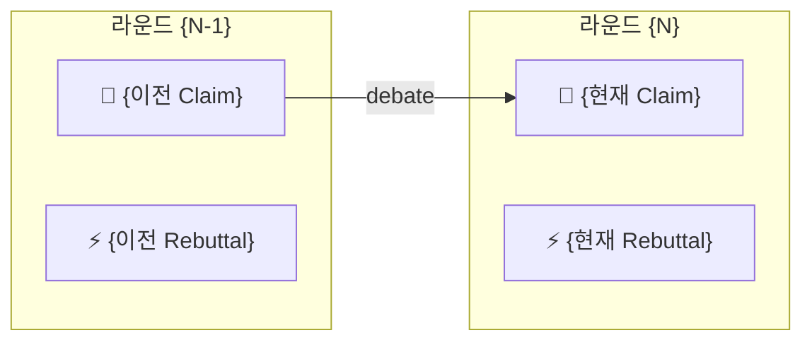

# /sowhat:map — 논증 흐름 시각화

논증의 흐름을 **Mermaid 다이어그램**으로 즉시 시각화하여 응답에 출력한다. `$ARGUMENTS`

파일 저장이 아닌 **지금 바로 보는 것**이 목적이다.

---

## 인자 파싱

```
/sowhat:map [section] [--save]
```

| 인자 | 의미 |
|------|------|
| 인자 없음 | 전체 논증 흐름 맵 |
| `{section}` (번호 또는 이름) | 해당 섹션 상세 맵 |
| `--save` | 파일로도 저장 (`maps/overview.md` 또는 `maps/local/{name}.md`) |

모드 결정: `{section}` 존재 → Local 모드, 없으면 → Global 모드

---

## 사전 준비

1. `planning/config.json` 로드
2. `00-thesis.md` 로드

---

## 노드 설계

각 노드는 **파일명이 아닌 실제 명제 문장**을 담는다.

### 노드 타입

| 타입 | 아이콘 | 내용 |
|------|--------|------|
| Thesis | 💡 | Answer 전체 문장 |
| Key Argument | 🧩 | Key Argument 한 줄 |
| Claim | 📌 | 실제 주장 문장 |
| Grounds | 🔍 | 근거/자료 핵심 문장 |
| Warrant | 🔗 | 추론 연결 문장 |
| Rebuttal | ⚡ | 반박 문장 |
| Response | ↩ | 재반론 문장 |

### 노드 스타일 (Mermaid classDef)

```
classDef thesis fill:#91caff,stroke:#4096ff,color:#000
classDef keyarg fill:#d3adf7,stroke:#9254de,color:#000
classDef settled fill:#b7eb8f,stroke:#52c41a,color:#000
classDef discussing fill:#ffe58f,stroke:#faad14,color:#000
classDef draft fill:#f0f0f0,stroke:#bfbfbf,color:#000
classDef revision fill:#ffccc7,stroke:#ff4d4f,color:#000
classDef grounds fill:#e6f4ff,stroke:#91caff,color:#000
classDef rebuttal fill:#fff1f0,stroke:#ffa39e,color:#000
```

### 텍스트 처리

- 노드 내 텍스트는 **50자 이내**로 잘라 `...` 추가
- `\n` 사용 금지 — Mermaid 노드는 단일행만 지원
- 빈 필드는 노드 생성 안 함 (생략)

---

## Global 모드

### 1. 데이터 수집

`00-thesis.md` 에서:
- Answer (Thesis 문장)
- Key Arguments 목록

각 섹션 파일에서:
- `status`
- Claim 핵심 문장
- Grounds 핵심 문장 (있으면)
- Warrant 핵심 문장 (있으면)
- Rebuttal 문장 (있으면)
- `thesis_argument` (어느 Key Arg에 속하는지)

### 2. Mermaid 생성 규칙

`flowchart TD` 사용 (위→아래).

```
flowchart TD
  T["💡 {Answer 50자...}"]:::thesis

  T --> KA1["🧩 {Key Arg 1}"]:::keyarg
  T --> KA2["🧩 {Key Arg 2}"]:::keyarg

  KA1 --> S1["📌 {Claim 50자...}"]:::settled
  S1 -.->|근거| G1["🔍 {Grounds 50자...}"]:::grounds
  S1 -->|반박| R1["⚡ {Rebuttal 50자...}"]:::rebuttal
  R1 -->|재반론| RE1["↩ {Response 50자...}"]:::settled

  KA2 --> S2["📌 {Claim 50자...}"]:::discussing

  classDef thesis fill:#91caff,stroke:#4096ff,color:#000
  classDef keyarg fill:#d3adf7,stroke:#9254de,color:#000
  classDef settled fill:#b7eb8f,stroke:#52c41a,color:#000
  classDef discussing fill:#ffe58f,stroke:#faad14,color:#000
  classDef grounds fill:#e6f4ff,stroke:#91caff,color:#000
  classDef rebuttal fill:#fff1f0,stroke:#ffa39e,color:#000
```

**연결 원칙:**
- Thesis → 각 Key Argument
- Key Argument → 해당 섹션의 Claim
- Claim → Grounds (있으면, 점선 `-.->|근거|`)
- Claim → Warrant (있으면, 점선 `-.->|추론|`)
- Claim → Rebuttal (있으면, 실선 `-->|반박|`)
- Rebuttal → Response (있으면, 실선 `-->|재반론|`)

### 3. 응답 출력 형식

다이어그램을 **응답 본문에 직접 렌더링**한다:

````markdown
## 논증 흐름 맵

```mermaid
{생성된 다이어그램}
```

**{settled}/{total} settled** | needs-revision: {목록 또는 없음}
````

`--save` 플래그 있을 때만 `maps/overview.md`에 추가 저장 후:
```
💾 maps/overview.md 저장 완료
```

---

## Local 모드

특정 섹션의 Toulmin 구조 전체를 더 상세하게 보여준다.

### 1. 섹션 파일 확인

- 숫자 → `{N}-*.md` 패턴 검색
- 이름 → `*-{name}.md` 패턴 검색
- 없으면 → `❌ 섹션을 찾을 수 없습니다: {section}`

### 2. 데이터 수집

- `00-thesis.md`: Answer, 해당 섹션의 Key Argument
- 현재 섹션: Claim, Grounds, Warrant, Backing, Qualifier, Rebuttal, Open Questions 전체

### 3. Mermaid 생성 (섹션 상세)

```
flowchart TD
  T["💡 {Answer 50자}"]:::thesis
  KA["🧩 {Key Arg}"]:::keyarg
  C["📌 {Claim 문장}"]:::{status}
  G["🔍 {Grounds 핵심}"]:::grounds
  W["🔗 {Warrant 핵심}"]:::grounds
  B["📚 {Backing 핵심}"]:::grounds
  Q["🎯 {Qualifier}"]:::draft
  R["⚡ {Rebuttal 문장}"]:::rebuttal
  OQ["❓ {Open Questions}"]:::draft

  T --> KA --> C
  C -.->|근거| G
  C -.->|추론| W
  W -.->|뒷받침| B
  C -.->|한정| Q
  C -->|반박| R
  C -.->|미해결| OQ
```

### 4. 응답 출력 형식

````markdown
## {섹션 이름} — 논증 상세

```mermaid
{생성된 다이어그램}
```
````

`--save` 플래그 있을 때만 `maps/local/{section-name}.md`에 추가 저장.

---

## Debate 맵 (자동 호출)

`/sowhat:debate` 라운드 완료 시 자동 호출.

이전 상태는 git에서 가져온다:
```bash
git show HEAD~1:{section-file}.md
```

이전 Claim/Warrant/Rebuttal(회색) vs 현재(파랑) 비교를 **응답에 직접 출력**:

````markdown
## debate 변화 — {섹션} 라운드 {N}


````

---

## 핵심 원칙

- **인라인 우선** — 파일 저장이 아닌 응답 본문에 Mermaid 코드블록으로 직접 출력
- **`--save`는 옵션** — 명시적으로 요청할 때만 파일 저장
- **명제 중심** — 노드 내용은 파일명이 아닌 실제 주장·근거·반박 문장
- **50자 제한** — 30자보다 넓게 허용해 내용 전달력 확보
